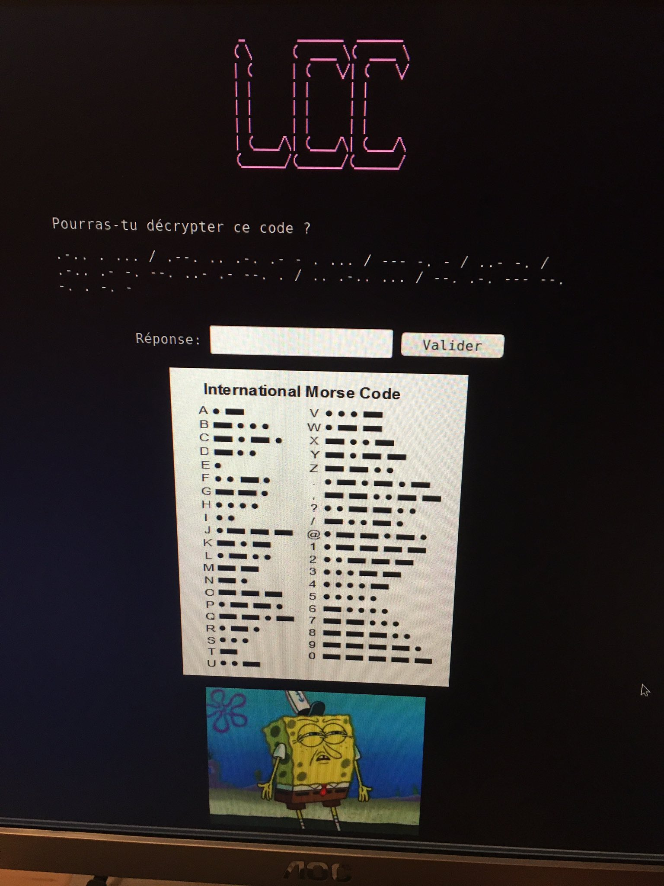

# Portable CTF for teenagers


## Goal of the project

To build an easy ctf for teenagers for their first steps in ctf. I made one for my nephew with a small difficulty. But you can create easily your own enigma with the difficulty you want.

This ctf was made quickly for a teenager without notion of html, javascript,... so it's easy to crack. If I had time, I'd do a specific back end ...  maybe for a next release.


## How to ?

- Setup your raspberry 
- Create an access point
- Create an apache server
- Create and deliver your htmls in ctf folder
- Electricity economy
- Generate certificates for https

## Setup your raspberry

### Installation of raspbian image on sdcard

Download the lite image of raspbian and unzip it

Plug your sdcard on your computer and check the output of sdcard
```
lsblk
```
Then forge the sdcard
```
dd bs=4M if=2019-07-10-raspbian-buster-lite.img of=/dev/sdb conv=fsync
```
### ssh activation
In boot partition create a "ssh" empty file (without extension) to activate ssh

### Usb ethernet (for pi zero if you want)
In config.txt file, add at the end add :
```
dtoverlay=dwc2
```
In cmdline.txt add after rootwait
```
modules-load=dwc2,g_ether
```


### Config raspberry
Plug your sdcard in your raspberry and start it

run 
```
sudo raspi-config
```
To finalize configuration (change partition size, change password,...)
```
sudo apt update
sudo apt upgrade
```
## Create an access point

```
sudo apt install dnsmasq hostapd

sudo systemctl stop dnsmasq
sudo systemctl stop hostapd

sudo nano /etc/dhcpcd.conf
    interface wlan0
        static ip_address=192.168.1.1/24
        nohook wpa_supplicant

sudo service dhcpcd restart

sudo mv /etc/dnsmasq.conf /etc/dnsmasq.conf.orig

sudo nano /etc/dnsmasq.conf
    interface=wlan0      # Use the require wireless interface - usually wlan0
    dhcp-range=192.168.1.2,192.168.1.20,255.255.255.0,24h
    address=/#/192.168.1.1


sudo systemctl reload dnsmasq

```

### Configuring wifi
sudo nano /etc/hostapd/hostapd.conf

```
interface=wlan0
driver=nl80211
ssid=CTF - wifi
hw_mode=g
channel=7
wmm_enabled=0
macaddr_acl=0
auth_algs=1
ignore_broadcast_ssid=0
wpa=2
wpa_passphrase=
wpa_key_mgmt=WPA-PSK
wpa_pairwise=TKIP
rsn_pairwise=CCMP
country_code=CA
```
no password set

sudo nano /etc/default/hostapd

DAEMON_CONF="/etc/hostapd/hostapd.conf"

sudo systemctl unmask hostapd
sudo systemctl enable hostapd
sudo systemctl start hostapd

sudo systemctl status hostapd
sudo systemctl status dnsmasq


### Shutdown
The RPi is not easy to shutdown, you have to go in the shell and run as sudoer a "shutdown -h now" to stop your system before unplug electricity.

So it's possible to add a button between GND and some pin and use a python script to do it automatically.

You'll need some hardware, I choose a cherry mx button plugged between GPIO pin 18 and GND. If you change that, change the next script.

Then you can run a script monitoring the button.

For that create a file named "shutdown_pi.py" in /home/pi/workspace/

and then add:
```
#!/bin/python 
# Simple script for shutting down the raspberry Pi at the press of a button. 
# by Inderpreet Singh 
import RPi.GPIO as GPIO  
import time  
import os  
# Use the Broadcom SOC Pin numbers 
# Setup the Pin with Internal pullups enabled and PIN in reading mode. 
GPIO.setmode(GPIO.BCM)  
GPIO.setup(18, GPIO.IN, pull_up_down = GPIO.PUD_UP)  
# Our function on what to do when the button is pressed 
def Shutdown(channel):  
   os.system("sudo shutdown -h now")  

# Add our function to execute when the button pressed event happens 
GPIO.add_event_detect(18, GPIO.FALLING, callback = Shutdown, bouncetime = 2000)  

# Now wait! 
while 1:  
   time.sleep(1) 

```

chmod +x shutdown_pi.py (not necessary)

Then:
```
sudo nano /etc/rc.local
```
And finally place this line "before the final exit 0 ":
```
python /home/pi/workspace/shutdown_pi.py & 
```


### Captival portal (experimental)
sudo apt install iptables-persistent
sudo nano iptable-reset.sh 

```
#!/bin/sh
echo "Stopping firewall and allowing everyone..."
iptables -F
iptables -X
iptables -t nat -F
iptables -t nat -X
iptables -t mangle -F
iptables -t mangle -X
iptables -P INPUT ACCEPT
iptables -P FORWARD ACCEPT
iptables -P OUTPUT ACCEPT

echo "clean of rules"
service iptables-persistent flush
iptables -L -v -n

```

chmod +x iptable-reset.sh

sudo nano iptable-set.sh

```
#!/bin/bash
 
 
## On flush iptables.
/sbin/iptables -F
 
## On supprime toutes les chaînes utilisateurs.
/sbin/iptables -X
 
## On drop tout le trafic entrant.
/sbin/iptables -P INPUT ACCEPT
 
## On drop tout le trafic sortant.
/sbin/iptables -P OUTPUT ACCEPT
 
## On drop le forward.
/sbin/iptables -P FORWARD ACCEPT

## ssh
/sbin/iptables -A INPUT -p tcp --dport 22 -j ACCEPT

## captive portal
/sbin/iptables -t nat -A PREROUTING -i wlan0 -p tcp -m tcp -s 192.168.1.0/24 --dport 80 -j DNAT --to-destination 192.168.1.1:80

/sbin/iptables -t nat -A PREROUTING -i wlan0 -p tcp -m tcp -s 192.168.1.0/24 --dport 443 -j DNAT --to-destination 192.168.1.1:80

/sbin/iptables -t nat -A PREROUTING -i wlan0 -p udp -m udp --dport 53 -j DNAT --to-destination 192.168.1.1:53

/sbin/iptables -t nat -A POSTROUTING -j MASQUERADE

## On accepte la boucle locale en entrée.
#/sbin/iptables -I INPUT -i lo -j ACCEPT

##Sauve les regles pour le prochain redémarrage
service iptables-persistent save

iptables -L -v -n
 
exit 0


```

chmod +x iptable-set.sh


## Setup apache server

### Install apache
sudo apt install apache2 -y

sudo nano /etc/apache2/sites-enabled/000-default.conf
```
<VirtualHost *:80>
        ServerAdmin webmaster@localhost
        DocumentRoot /var/www/html

        <Directory /var/www/html/>
                Options Indexes FollowSymLinks
                ErrorDocument 404 http://alexandria.local
                AllowOverride All
                Require all granted
        </Directory>
</VirtualHost>

```

sudo a2enmod autoindex

### Add fancy theme

sudo apt install git
cd /var/www/html
sudo git clone https://github.com/Vestride/fancy-index.git
cd fancy-index
sudo mv .htaccess ..
sudo nano .htaccess and add "/fancy-index" in line: fancy-index (IndexIgnore .ftpquota .DS_Store .git /fancy-index)

### Access
sudo chown www-data:www-data -R /var/www/html
sudo chmod 775 /var/www
sudo chmod -R g+w /var/www/html
sudo usermod -a -G www-data pi
(logout and login again)


## Create and deliver your htmls in ctf folder

Create your htmls files with enigma of difficulty you want

Just push files in html/ into /var/www/html directory



You can add prizes into 3.141592 directory

I give you mines with css and js as examples (sorry it's in french), as already said it's easy to crack because there's no backend only js, every soluce are embedded inside js script, if you deactivate js in your browser (as you'd be doing!!) there no check of your answer . 


## Electicity economy for battery

desactivate hdmi:
/usr/bin/tvservice -o
reactivate hdmi:
/usr/bin/tvservice -p

### Set the Pi Zero ACT LED trigger to 'none'.
echo none | sudo tee /sys/class/leds/led0/trigger

### Turn off the Pi Zero ACT LED.
echo 1 | sudo tee /sys/class/leds/led0/brightness

In /boot/config.txt
## Disable the ACT LED on the Pi Zero.
dtparam=act_led_trigger=none
dtparam=act_led_activelow=on


## Generate certificates for https

    sudo openssl req -x509 -nodes -days 365 -newkey rsa:2048 -keyout /etc/ssl/private/apache-selfsigned.key -out /etc/ssl/certs/apache-selfsigned.crt

NB: Common Name (e.g. server FQDN or YOUR name) []:server_IP_address

    sudo openssl dhparam -out /etc/ssl/certs/dhparam.pem 2048
    
    sudo nano /etc/apache2/conf-available/ssl-params.conf

```
# from https://cipherli.st/
# and https://raymii.org/s/tutorials/Strong_SSL_Security_On_Apache2.html

SSLCipherSuite EECDH+AESGCM:EDH+AESGCM:AES256+EECDH:AES256+EDH
SSLProtocol All -SSLv2 -SSLv3
SSLHonorCipherOrder On
# Disable preloading HSTS for now.  You can use the commented out header line that includes
# the "preload" directive if you understand the implications.
#Header always set Strict-Transport-Security "max-age=63072000; includeSubdomains; preload"
Header always set Strict-Transport-Security "max-age=63072000; includeSubdomains"
Header always set X-Frame-Options DENY
Header always set X-Content-Type-Options nosniff
# Requires Apache >= 2.4
SSLCompression off 
SSLSessionTickets Off
SSLUseStapling on 
SSLStaplingCache "shmcb:logs/stapling-cache(150000)"

SSLOpenSSLConfCmd DHParameters "/etc/ssl/certs/dhparam.pem"
```
    sudo cp /etc/apache2/sites-available/default-ssl.conf /etc/apache2/sites-available/default-ssl.conf.bak
    sudo nano /etc/apache2/sites-available/default-ssl.conf

```
<IfModule mod_ssl.c>
        <VirtualHost _default_:443>
                ServerAdmin your_email@example.com
                ServerName 192.168.1.1

                DocumentRoot /var/www/html
                <Directory /var/www/html/>
                    Options Indexes FollowSymLinks
                    ErrorDocument 404 https://alexandria.local
                    AllowOverride All
                    Require all granted
                </Directory>


                SSLEngine on

                SSLCertificateFile      /etc/ssl/certs/apache-selfsigned.crt
                SSLCertificateKeyFile /etc/ssl/private/apache-selfsigned.key


                BrowserMatch "MSIE [2-6]" \
                               nokeepalive ssl-unclean-shutdown \
                               downgrade-1.0 force-response-1.0

        </VirtualHost>
</IfModule>
```

    sudo a2enmod ssl
    sudo a2enmod headers
    sudo a2ensite default-ssl
    sudo a2enconf ssl-params
    sudo apache2ctl configtest
    
    sudo nano /etc/apache2/apache2.conf
        put ServerName 192.168.1.1 
    
    sudo systemctl restart apache2